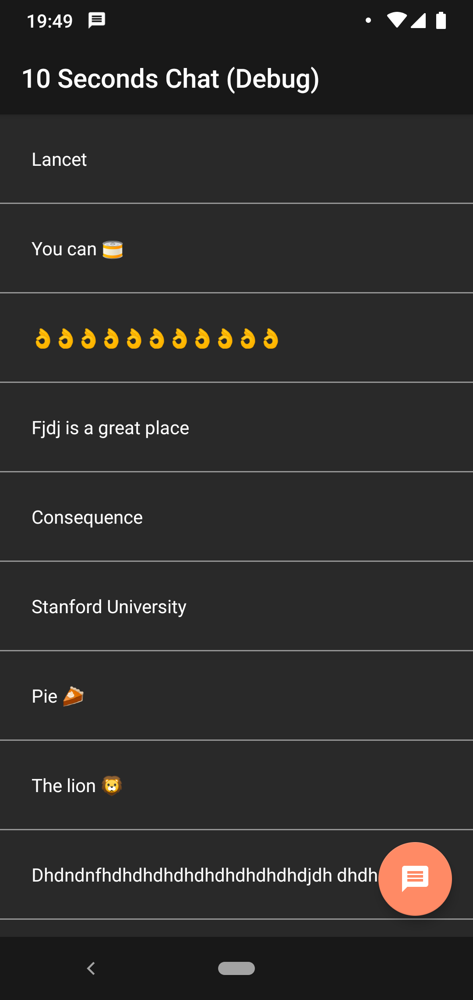
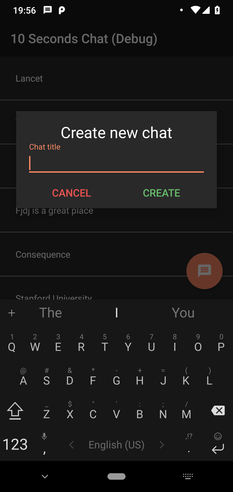
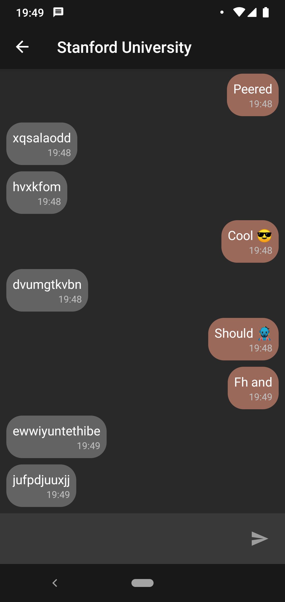
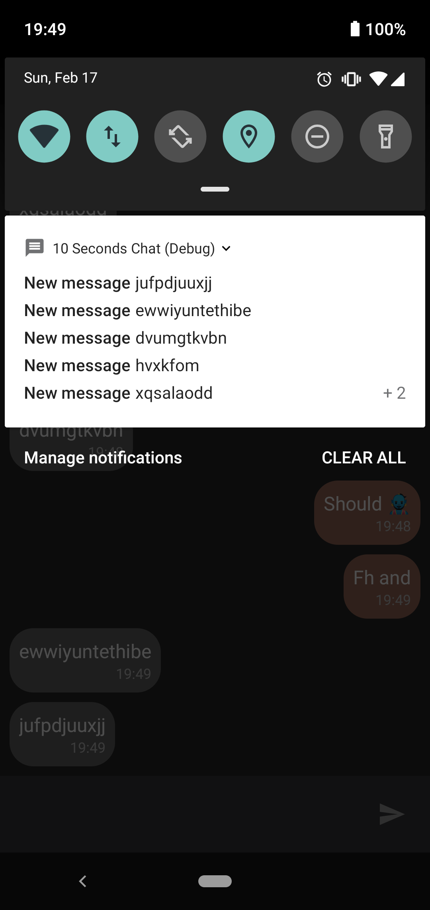

# 10 Seconds Chat
An offline chat app which generates random answer in 10 seconds after 
you write a message. Uses Clean Architecture, MVVM, Android Architecture 
Components (Data Binding, Lifecycles, LiveData, Room, ViewModel, 
WorkManager), RxKotlin, Koin.

Screenshots:

 
 